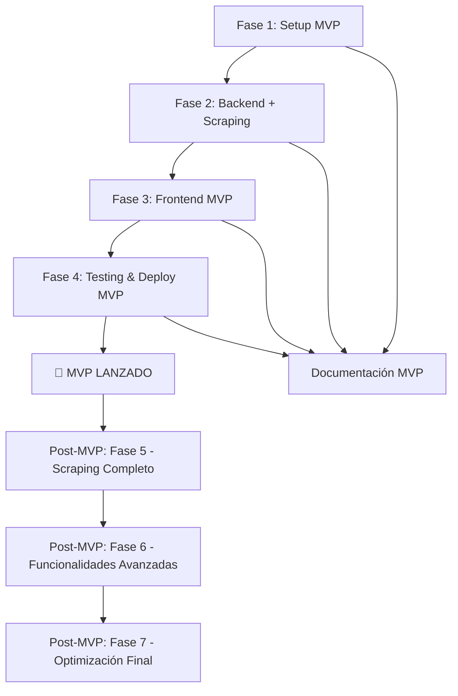

# 📋 Plan de Trabajo - Caminando Online

[Este documento presenta el plan de trabajo enfocado en el desarrollo de un **MVP funcional** de la plataforma Caminando Online, con las funcionalidades core operativas y un roadmap claro para expansiones futuras.]

## 📊 Visión General del Plan

### 🎯 Objetivo General - MVP
Desarrollar un **MVP funcional** que permita a los usuarios comparar precios de productos entre supermercados argentinos, con las siguientes funcionalidades core:

#### ✅ Funcionalidades MVP:
- **🏠 Index funcional**: Página principal con comparación de precios
- **📊 Productos comparados**: Resultados detallados de comparación
- **👤 Dashboard básico**: Panel de usuario con historial y preferencias
- **🔄 Scraping básico**: Datos de al menos 2-3 supermercados
- **📱 Responsive**: Funcional en desktop y mobile

#### 🔄 Post-MVP (Futuro):
- Sistema completo de scraping para 5 supermercados
- Funcionalidades avanzadas (recomendaciones, analytics)
- Integraciones externas (delivery, pagos)
- Gamificación y monetización

### 📅 Duración Estimada - MVP
- **Fase 1**: 1-2 semanas (Setup y Arquitectura)
- **Fase 2**: 2-3 semanas (Backend Core + Scraping Básico)
- **Fase 3**: 3-4 semanas (Frontend MVP)
- **Fase 4**: 1-2 semanas (Testing y Despliegue MVP)
- **Total MVP**: 7-11 semanas (1.5-2.5 meses)

### 👥 Equipo Recomendado
- **Desarrollador Fullstack**: 1-2 personas
- **Diseñador UX/UI**: 1 persona (part-time para primeras fases)
- **QA Tester**: 1 persona (part-time)

## 📂 Estructura de Fases - MVP

### [Fase 1: Setup y Arquitectura MVP](./fase-1-configuracion-proyecto.md)
**Duración**: 1-2 semanas
**Objetivo**: Establecer base técnica enfocada en MVP

#### Tareas Principales:
- ✅ Configuración del repositorio Git
- ✅ Estructura base del proyecto (MVP-focused)
- ✅ Arquitectura simplificada frontend/backend
- ✅ Base de datos esencial
- ✅ Infraestructura mínima viable

**Entregables**:
- Proyecto base Next.js + Node.js inicializado
- Base de datos configurada
- Estructura modular preparada
- Documentación MVP

---

### [Fase 2: Backend Core + Scraping Básico](./fase-2-backend-database.md)
**Duración**: 2-3 semanas
**Objetivo**: API esencial + scraping de 2-3 supermercados

#### Tareas Principales:
- ✅ API REST para comparación de precios
- ✅ Base de datos para productos y usuarios
- ✅ Scraping básico (2-3 supermercados principales)
- ✅ Autenticación básica
- ✅ Endpoints core para MVP

**Entregables**:
- API funcional para comparación
- Datos de productos de 2-3 supermercados
- Sistema de usuarios básico
- Documentación de API

---

### [Fase 3: Frontend MVP](./fase-3-frontend-mvp.md)
**Duración**: 3-4 semanas
**Objetivo**: Interfaz completa para funcionalidades MVP

#### Tareas Principales:
- ✅ Index con comparación funcional
- ✅ Página de productos comparados
- ✅ Dashboard básico de usuario
- ✅ Navegación y UX core
- ✅ Responsive design

**Entregables**:
- Index completamente funcional
- Sistema de comparación operativo
- Dashboard de usuario básico
- Interfaz responsive y usable

---

### [Fase 4: Testing y Lanzamiento MVP](./fase-4-testing-lanzamiento-mvp.md)
**Duración**: 1-2 semanas
**Objetivo**: Validar calidad y desplegar MVP

#### Tareas Principales:
- ✅ Testing funcional del MVP
- ✅ Optimizaciones básicas
- ✅ Despliegue en producción
- ✅ Monitoreo inicial
- ✅ Validación con usuarios

**Entregables**:
- MVP desplegado y funcional
- Tests básicos pasando
- Monitoreo configurado
- Feedback inicial recopilado

## 🔄 Flujo de Desarrollo - MVP

## 📈 Métricas de Éxito - MVP

| Fase | Métrica Principal | Target |
|------|------------------|---------|
| **Fase 1** | Tiempo setup | < 30 min |
| **Fase 2** | API funcional | 100% endpoints core |
| **Fase 3** | UX completa | 100% funcionalidades MVP |
| **Fase 4** | MVP desplegado | Uptime > 95% |

## 🎯 Roadmap Post-MVP

### Fase 5: Sistema de Scraping Avanzado (4-6 semanas)
- [ ] Vinculación avanzada con 5 supermercados
- [ ] Scraping de ofertas y promociones
- [ ] Sistema anti-detección robusto
- [ ] Automatización completa y monitoreo

### Fase 6: Funcionalidades Avanzadas (6-8 semanas)
- [ ] Sistema de recomendaciones inteligente
- [ ] Analytics y reportes avanzados
- [ ] Integraciones externas (delivery, pagos)
- [ ] PWA completa
- [ ] Gamificación y monetización

### Fase 7: Optimización y Escalabilidad (3-4 semanas)
- [ ] Testing exhaustivo
- [ ] Optimización de performance
- [ ] Infraestructura de producción completa
- [ ] Monitoreo avanzado

## ⚠️ Riesgos y Dependencias Críticas - MVP

### Riesgos Principales:
- **Alcance del MVP**: Asegurar funcionalidades core completas
- **Dependencia de scraping**: Validar que 2-3 supermercados sean suficientes
- **Complejidad técnica**: Mantener simplicidad para velocidad

### Dependencias Críticas:
- **Fase 1**: Base técnica sólida
- **Fase 2**: Datos y API funcionales
- **Fase 3**: UX que valide el concepto
- **Fase 4**: Despliegue rápido para feedback

## 📋 Checklist General del Proyecto - MVP

### Pre-Desarrollo
- [ ] Requisitos MVP claramente definidos
- [ ] Equipo definido y disponible
- [ ] Tecnologías para MVP seleccionadas
- [ ] Plan de MVP aprobado

### Desarrollo MVP
- [ ] Fase 1 completada (Setup)
- [ ] Fase 2 completada (Backend + Scraping)
- [ ] Fase 3 completada (Frontend MVP)
- [ ] Fase 4 completada (Testing & Deploy)

### Validación MVP
- [ ] Funcionalidades core operativas
- [ ] Usuarios pueden comparar precios
- [ ] Dashboard básico funcional
- [ ] Performance aceptable

### Post-MVP Planning
- [ ] Feedback de usuarios recopilado
- [ ] Métricas de uso analizadas
- [ ] Roadmap post-MVP definido
- [ ] Prioridades de desarrollo claras

## 🎯 Próximos Pasos Recomendados

1. **Definir alcance exacto del MVP** - confirmar funcionalidades core
2. **Seleccionar supermercados prioritarios** para scraping inicial
3. **Configurar entorno de desarrollo** básico
4. **Iniciar Fase 1** con setup del proyecto
5. **Establecer milestones semanales** para tracking

## 💡 Estrategia MVP

### Principios:
- **Enfoque en lo esencial**: Solo funcionalidades que validen el concepto
- **Velocidad sobre perfección**: Priorizar velocidad de desarrollo
- **Aprendizaje validado**: Obtener feedback real de usuarios
- **Escalabilidad preparada**: Arquitectura que permita crecimiento

### Validación del MVP:
- **Métrica principal**: Usuarios completan comparación exitosamente
- **Éxito mínimo**: 70% de usuarios logran usar la funcionalidad core
- **Feedback cualitativo**: Entrevistas con usuarios para insights
- **Métricas técnicas**: Performance y estabilidad básicas

## 📞 Contacto y Soporte

- **Documentación Técnica**: `docs/README.md`
- **Arquitectura**: `docs/secciones/`
- **Procesos**: `docs/procesos/`
- **Soporte**: Crear issue en repositorio

---

*📅 Plan MVP creado: Septiembre 2025*
*🎯 Enfoque: Desarrollo rápido de producto funcional*
*📚 Documentación técnica completa disponible*
